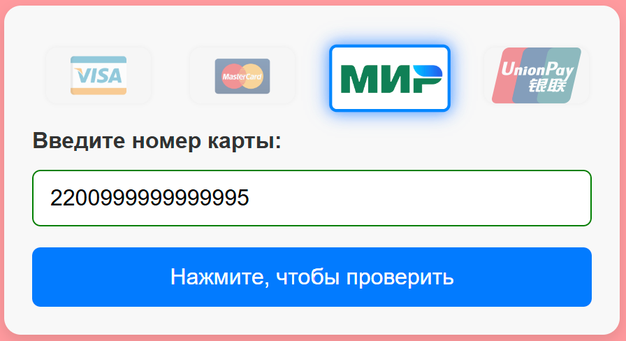
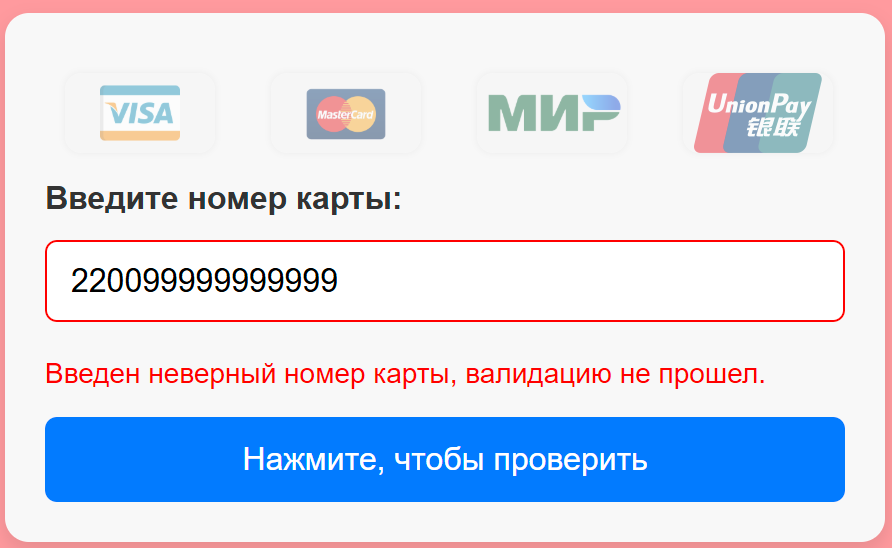

# 💳 Credit Card Validator

[](https://ci.appveyor.com/project/dm-morozov/netology-54-testing-organization)


Проект реализует виджет для проверки номера банковской карты по алгоритму Луна, а также определения платёжной системы: Visa, MasterCard, Мир, UnionPay.




## 📦 Стек технологий

- TypeScript
- HTML/CSS
- Webpack
- Jest (Unit-тесты)
- Playwright (e2e)
- CI: GitHub Actions, AppVeyor

## 🚀 Демо

🔗 [Открыть в GitHub Pages](https://dm-morozov.github.io/Netology_54_testing_organization/)

## 🧪 Валидация

Алгоритм Луна реализован в `validator.ts`, определение платёжной системы — в `cardDetector.ts`.

**Поддерживаемые системы:**

- ✅ Visa
- ✅ MasterCard
- ✅ Мир
- ✅ UnionPay

Примеры валидных номеров карт (для ручной проверки):
```

Visa:           4111111111111111
MasterCard:     5555555555554444
МИР:            2200123456789013
UnionPay:       6221260000000000

````

## 📦 Установка

```bash
git clone https://github.com/dm-morozov/Netology_54_testing_organization
cd Netology_54_testing_organization
npm install
npm run build
npm run start
````

## 📂 Структура проекта

```
├── src/
│   ├── index.html
│   ├── index.ts           # Точка входа
│   ├── styles/
│   ├── img/
│   └── ts/
│       ├── main.ts
│       ├── validator.ts
│       ├── cardDetector.ts
│       ├── ui.ts
│       └── __tests__/
├── dist/
├── webpack.common.mjs
├── webpack.dev.mjs
├── webpack.prod.mjs
├── licenses.txt
```

## ✅ Тесты

```bash
npm run test       # Unit-тесты через Jest
npm run e2e        # End-to-End через Playwright
```

## ⚙️ CI/CD

* GitHub Actions: проверка сборки, unit-тесты
* AppVeyor: альтернатива CI для сборки на Windows
* Автоматическое выкладывание в GitHub Pages

## 📧 Контакты

Если возникнут вопросы, пишите:

*  [LinkedIn](https://www.linkedin.com/in/dm-morozov/)
*  [Telegram](https://t.me/dem2014)
*  [GitHub](https://github.com/dm-morozov/)